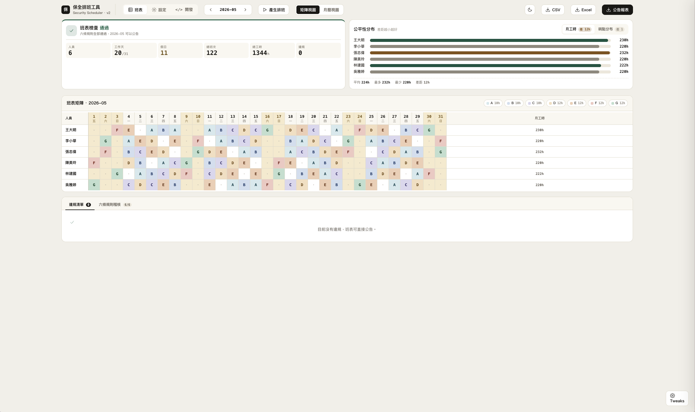
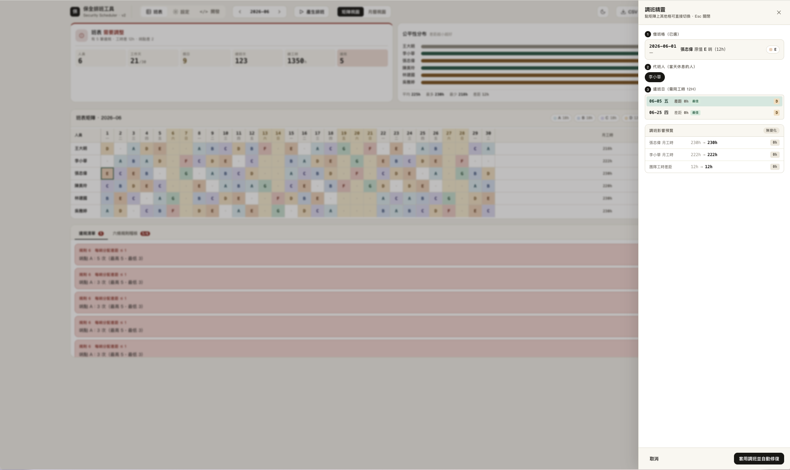

# 保全排班工具 · Security Scheduler

> A side project showcasing **PM × AI collaboration** — from a 30-minute user interview to a shipped product in ~6 hours.
>
> 一個 PM 在 AI 協作下完成的 side project：30 分鐘訪談、6 小時開發、解決使用者每月 1–2 小時的真實痛點。

**Language**: 中文（本頁） · [English](./README.en.md)

🔗 **[Live Demo](https://basil-guard-scheduler.vercel.app)**



---

## TL;DR

|  |  |
|---|---|
| **使用者** | 一位資深保全主管 |
| **痛點** | 每月手工排班 1–2 小時、6 條規則易算錯、有人請假就要重排 |
| **投入** | 30 分鐘訪談 + 6 小時開發（規劃 1h / UI 3h / 實作 2h） |
| **產出** | 自動排班、規則驗證、調班精靈、颱風假處理、台灣假日 API 整合 |
| **品質** | 2026 全年 12 個月 benchmark：硬違規 **0/12**、時數差 ≤12h **12/12** |
| **回饋** | 「以前算到頭很痛，現在班表自己跑出來，我看一下沒錯就送了，省事很多。」 |

---

## 1. 真實情境

使用者是一位資深保全主管，每個月要花 **1–2 小時**用 Excel 排下個月的班。排班規則有 6 條（連上限制、哨點輪替、假日交替、時數平衡⋯⋯），手算容易出錯。更麻煩的是：只要月中有人請假調班，整個下半月可能就要重排。

這是一個典型的「**高頻 × 規則明確 × 重複勞動**」場景，自動化 ROI 極高。

## 2. 我的做法

### 30 分鐘訪談 → 寫成可驗證的規格

跟使用者坐下來 30 分鐘，把以下事項全部釐清：

- 6 條硬規則（連續上班天數、哨點輪替、假日交替、時數平衡、配額平均⋯）
- 7 個哨點的差異（平日 A/B/C 10h、D/E 12h；假日 F/G 12h）
- 颱風假特殊邏輯（取消 A/B/C，D/E 改派 F/G）
- 「調班」場景（某人臨時請假 → 找代班 → 約定還班）

### 6 小時開發

| 區塊 | 時間 | 內容 |
|---|---|---|
| 規劃 | 1h | 規格化、技術選型、拆任務 |
| 實作 | 2h | 排班演算法、規則驗證、調班系統、localStorage |
| UI/UX | 3h | 設計 tokens、矩陣 + 月曆雙視圖、調班精靈、暖色系 design system |

> 注意 **UI 佔了一半時間 — 但這跟產品需求無關**。這是內部使用的工具，使用者只在意能不能解決問題；功能本身 2 小時就到位了。多花的 3 小時是我的個人實驗：當時 Claude Design 剛出，我順便用這個專案測試「AI 在純程式邏輯之外，做 UI/視覺設計能到什麼程度」。
>
> 換句話說，這個 side project 對我來說有兩層目的：**對使用者是排班工具，對我自己是 AI 協作能力的 sandbox**。

## 3. PM 思考的 4 個關鍵決策

### a. 純前端 + localStorage，不做後端

只有 1 個使用者，不需要帳號、多人協作或雲端同步。砍掉後端讓我能在 6 小時內 ship 產品，而不是花 6 小時搞 auth。**Scope 控制是 PM 工作。**

### b. 自己寫排班演算法，不用現成函式庫

兩個原因讓我選擇從頭寫：

- **規則相對客製**：6 條規則裡有平日 / 假日的差異、硬限制和軟限制混合（例如「月時數差 > 12h 算違規」），現成函式庫不一定能直接套用
- **想驗證 vibe coding 的可行性**：這個 side project 對我也是個實驗 — 一個 PM 能不能在 AI 協作下，從零做出一個處理真實業務邏輯的工具？自己寫演算法是把這個假設推到極限的好方法

決策過程：AI 列出可選方案（現成 solver / 自寫 backtracking / 線性規劃）並解釋各自取捨，由我根據上述兩個原因做選擇。

驗證：2026 全年 12 個月 benchmark — 硬違規 0/12、軟限制 100% 通過、每次運算 50–200ms。

### c. 調班做「最小改動」，不重排整個月

調班最直覺的做法是「rerun 排班演算法」。但這會打亂所有人的下半月班表 — 使用者已經記住下週的班、可能已經請假，全亂掉的代價極高。

所以我把調班定義成 **constrained problem**：鎖死「借班日之前所有班」+「借/還兩日的 4 格」當 baseline，演算法只能在這個約束下求解。**動越少越好** — 這是使用者心智模型的優先級，不是技術上的便利。



### d. 矩陣 + 月曆雙視圖，不選一個

同一份排班資料，有兩種讀法：

- **主管視角**：「這個月每個人工時平不平均？誰排了什麼哨？」→ 適合矩陣（人 × 日，一覽全貌）
- **保全視角**：「我這禮拜哪幾天上班？上什麼哨？」→ 適合月曆（按週排列，符合直覺）

只做矩陣，現場保全會嫌看不懂；只做月曆，主管 review 不順。**兩個都得做。**

成本：多 1.5 小時開發 + 兩個視圖要同步狀態。但少了任何一個，使用者都會覺得「我還是回去用 Excel 比較快」 — 那整個工具就失去意義。

## 4. AI 協作方法論

9 年 PM 經驗，這個專案的程式碼幾乎全由 Claude 產出。我的角色是：**定義問題、設計驗收標準、做技術決策、判斷 trade-off**。AI 抹平了實作門檻，但抹不平判斷力。我實際做的事情：

- **定義驗收標準**：12 個月 benchmark + 27 個單元測試。AI 產出沒過 benchmark 就重來，**不靠 AI 自評**
- **拆任務**：每次給 AI 的工作都是「一個 commit 大小」（30–60 分鐘可完成且可驗證）
- **做技術決策**：AI 列出選項並解釋取捨，由我選擇。上面 4 個決策都是這個模式 — 例如「自寫演算法 vs 現成 solver」，AI 攤開每個選項的優缺，我根據產品脈絡判斷
- **設計使用者體驗**：UI 改版的設計 tokens、互動流程、文案語氣，全是 PM 視角

## 5. 成果

- **Live**：[basil-guard-scheduler.vercel.app](https://basil-guard-scheduler.vercel.app)
- **演算法品質**：2026 全年 12 個月 benchmark，硬違規 0/12，時數差 ≤12h 12/12
- **使用者反饋**：「以前算到頭很痛，現在班表自己跑出來，我看一下沒錯就送了，省事很多。」
- **規模**：~5,500 行 TypeScript / 31 個元件 / 27 個單元測試

## 6. 學到什麼

1. **PM 的價值在「定義問題 + 驗收標準」**，AI 抹平了實作門檻但抹不平判斷力
2. **真實使用者比想像中重要 10 倍** — 沒有具體使用者，scope 會無限膨脹
3. **AI 在不同領域的成熟度差很多** — 同樣是 AI，寫程式邏輯非常穩，做 UI/視覺設計直到最近（Claude Design 等工具）才追上來。Side project 是 PM 測試這些邊界的最好 sandbox
4. **驗收標準要可程式化** — Benchmark + 單元測試是 PM 跟 AI 協作的「韁繩」，沒有它 AI 會不斷產出看似 OK 但其實錯的程式碼

---

## Tech Spec

### Stack
- **Frontend**: React 19 + TypeScript + Vite
- **樣式**: 自訂 design tokens（CSS variables）
- **資料儲存**: localStorage（純前端，無後端）
- **部署**: Vercel
- **外部資料**: 台灣國定假日 API（api.pin-yi.me）

### 排班規則

| # | 規則 | 類型 |
|---|------|------|
| 1 | 不超過連續 6 天上班 | 硬 |
| 2 | 不重複相鄰哨點（同一哨點不連兩天） | 硬 |
| 3 | 假日星期交替（六↔日） | 硬 |
| 4 | 假日哨點交替（F↔G） | 硬 |
| 5 | 每人月總時數差距 ≤12h | 軟 |
| 6 | 每個哨點分配差距 ≤1 次 | 軟 |

### 哨點設定

| 哨點 | 類型 | 時數 |
|------|------|------|
| A / B / C | 平日 | 10h |
| D / E | 平日 | 12h |
| F / G | 假日 | 12h |

### 演算法
- **方法**：Random restart CSP backtracking（mulberry32 seedable RNG）
- **Phase 1**：`calcTargetCounts` — 逐哨點順序分配配額
- **Phase 2**：N 次 attempts，每次逐日用日內 backtracking（dynamic most-constrained-first）
- **目標函數**（字典序）：硬違規 → 時數超額 → 哨點超額 → 時數差 → 哨點差加總

## 本機執行

```bash
npm install
npm run dev
```

開啟 http://localhost:5173

## 測試

```bash
npm test          # 27 個單元測試
npm test -- benchmark   # 2026 全年 12 個月 benchmark
```
